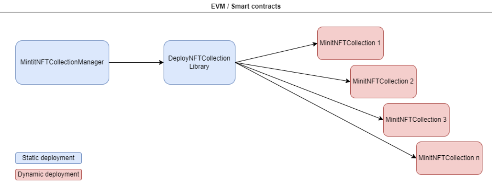
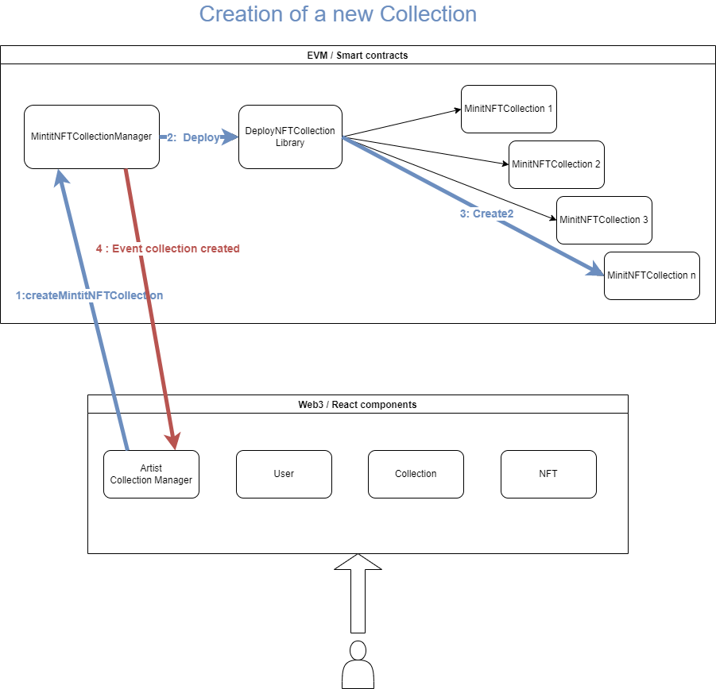
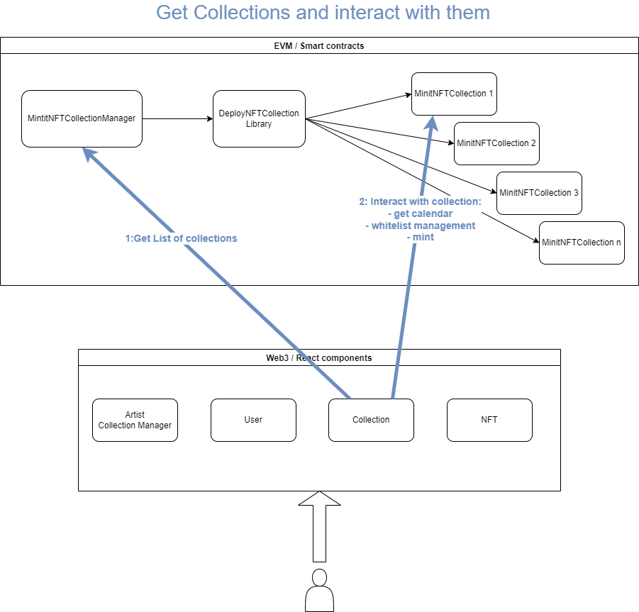

# Design pattern (in progress)

-   [Smart Contracts](#contracts)
    -   [MintitNFTCollectionManager](#MintitNFTCollectionManager)
    -   [DeployNFTCollection](#DeployNFTCollection)
    -   [MintitNFTCollection](#MintitNFTCollection)
-   [Use cases](#usecases)
    -   [Create collection](#createcollection)
    -   [Collection interactions](#collectioninteractions)
-   [Tools & dApp](#tools&dapp)

# Smart Contracts 

Several Smart Contracts have been created for the needs of the project.

    </img>

## MintitNFTCollectionManager 

This Smart Contract allows to get the list of collections and to create a collection (calls the smart contract deployNFTCollection) 
2 other smart counteracts are also included (Artists and Users) to return the list of artists, the artist's info and the addresses of the artist's collections.

## DeployNFTCollection 

Contains the function to deploy a collection. 
Import the bytecode of the contract to deploy.

## MintitNFTCollection 

This Smart Contract is dynamically deployed for each NFT Collection. 
Inherits from :
- ERC721Enumerable : ERC721 is standard interface for non-fungible tokens.
- ERC2981Collection : The artist can set royalties.
- ReentrancyGuard : A modifier that can prevent reentrancy during certain functions.
- PaymentSplitter : Help to transfer the amount of Ether according to the percentage of the total shares.
- Ownable : The artist is the owner of the contract and is allowed to call some functions.

# Use cases 

## Create collection 

    </img>

## Collection interactions 

    </img>

# Tools & dApp 

We use Truffle to deploy smart contracts. 
Ganache is used for development/testing of smart contracts but the beta will be deployed on the Kovan test blockchain so that users can test the application.  

The dApp is built with the React framework and web3.js (Ethereum JavaScript API). 
To design the UI of the application we use Tailwind CSS. 
The dApp is deployed on heroku : https://mintit.herokuapp.com/